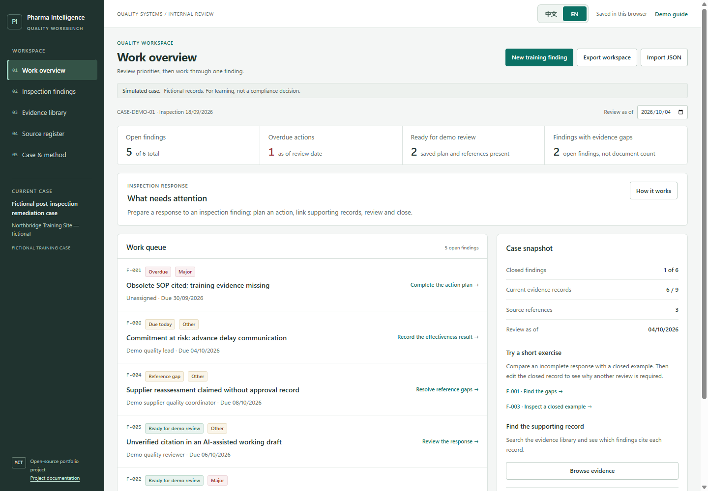
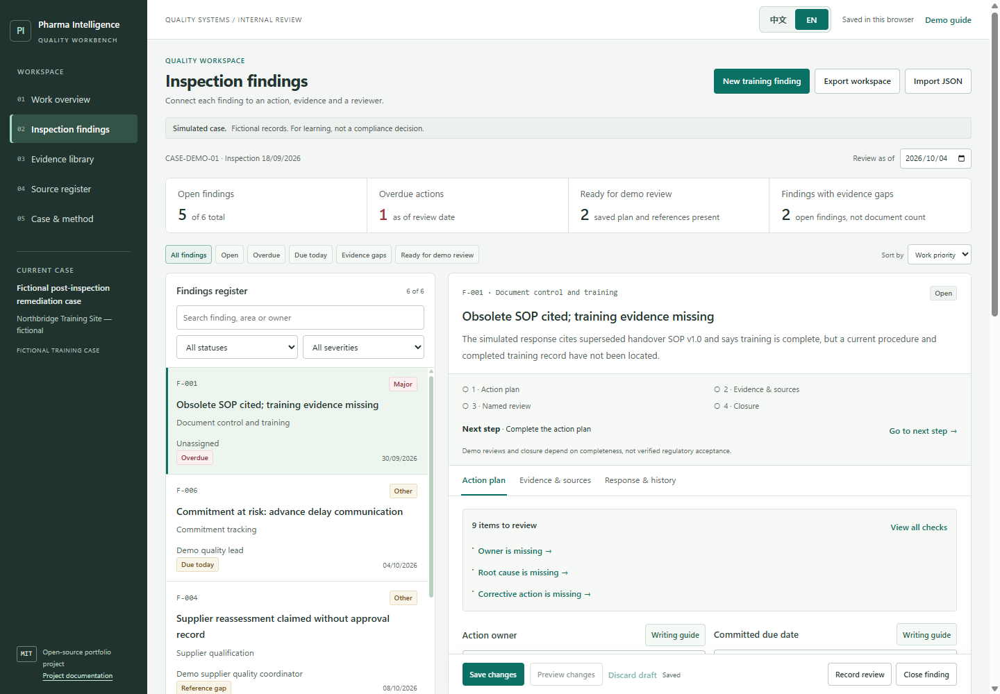

# Pharma Inspection Workbench

A learning tool that runs in your browser and helps you practise how pharmaceutical quality teams respond to inspection findings.

[中文说明](README.zh-CN.md) · [Case study](docs/case-study.md) · [Official sources](docs/source-notes.md) · [Interview guide](docs/interview-guide.md) · [Verification](docs/verification.md)



## Who is it for?

Students and applicants exploring pharmaceutical **QA (quality assurance)**: the work of checking that processes and records support consistent quality. It is a small module of the **Pharma Intelligence Platform** portfolio.

The practice problem is simple: a spreadsheet says an action is complete, but the evidence is missing or outdated, or nobody has reviewed the response. This tool keeps those gaps visible.

**CAPA** means corrective and preventive action: addressing a problem and reducing recurrence. **MHRA** is the UK's Medicines and Healthcare products Regulatory Agency. Three linked MHRA publications informed the fictional exercise.

## Open it

Use GitHub's **Code → Download ZIP**, extract the folder, and double-click `index.html`. No account, installation or API key is needed.

If browser storage is unreliable when opening the file directly, run this in the project folder with Python installed:

```sh
python -m http.server 4173 --bind 127.0.0.1
```

Open [http://127.0.0.1:4173](http://127.0.0.1:4173). Stop with `Ctrl+C`.

## Practise the five-step workflow

1. **Read the finding.** Identify the issue and what still needs investigation.
2. **Plan the work.** Record an owner, deadline, root cause, impact, actions and an effectiveness check.
3. **Connect references.** Select supporting demo evidence and official sources; inspect missing or outdated records.
4. **Save and review.** Resolve workflow gaps and record a typed reviewer's demo approval.
5. **Follow up.** Record an effectiveness result before closure, then export an internal report or backup.

Start on the work overview, then open **F-001**: try closing it and inspect the blockers. Its missing training record cannot be replaced by an unrelated document.

Then open the complete, closed **F-003**. Clarify one relevant action explanation and save. This invalidates approval and reopens the record. Inspect it, record a new demo review and close it again.

## Features in version 0.6

- **Smoother language changes:** click 中文 / EN directly. The editor, caret, draft, filters and scroll position are retained; display checks reuse the same saved snapshot. Local Chinese/English typography is easier to read, with brief panel/dialog feedback and support for reduced motion.

- **Change comparisons:** preview edited fields before saving, then view recorded before/after values in the local history. A reopened status is included; old entries without comparisons are labelled clearly.

- **Work overview:** an ordered queue with a useful next action for each open finding.
- **Clickable counts:** open, overdue, ready for demo review, and findings with evidence gaps.
- **Focused register:** quick filters, priority/deadline/ID sorting and search across the supplied English and Chinese text.
- **Writing guides:** nine field-specific question cards help you distinguish evidence, unknowns, planned action and completed results. The guide never fills a field for you.
- **Draft recovery:** when browser storage works, an uncommitted draft has a separate local recovery copy. After reload, choose Restore or Discard; it is never applied automatically.
- **Compact editing:** next-step links, retained drafts across tabs, a desktop save bar and `Ctrl/Cmd+S` to save. Press `/` outside a text field to focus search in the register or evidence library.
- **Evidence lookup:** search, version-status filters and links showing which findings cite each record.
- **New training finding**, local saving, change history, JSON backup/import and CSV/Markdown internal reports with English labels.

The queue orders overdue work first, then work due on the review date, reference gaps, records ready for demo review and remaining open work. This is a transparent work order, not a regulatory risk score. Changing the review date changes date-based flags; it does not edit findings or approvals.

“Ready for demo review” means the saved plan and selected references pass completeness checks. A completed effectiveness result is separately required for closure. “Findings with evidence gaps” counts affected open findings, not individual documents or reference gaps. A selected document still needs human assessment.



[See the writing guide](docs/screenshots/guidance.png) · [See draft recovery](docs/screenshots/draft-recovery.png)

Use **Preview changes** after editing F-003 to see exactly what will change and whether saving resets review. Preview does not save anything; you can keep editing or save from the preview. After saving, open **Response & history → View saved changes**. Comparisons keep the actual stored text, not its display translation. New JSON backups retain the comparisons and Markdown reports include them; CSV contains the current register. Open new backups with version 0.5 or later. These local snapshots are editable and are not an authenticated audit trail.

[See a change preview](docs/screenshots/changes.png) · [See a saved comparison](docs/screenshots/saved-changes.png)

A recovery copy is **not a saved finding**: it does not update counts, reviews, history or exports. Use **Save changes** to commit your edits. Restoring a draft also requires Save; discarding it keeps saved records intact. Editing an approved or closed finding resets its review only when you save a material change.

One active finding draft is recoverable per browser address. Navigating to another finding still asks before discarding uncommitted edits. Changed base records or malformed recovery data are not restored. Recovery depends on browser storage; it is not a controlled backup, a shared draft or autosaving into the case. If storage fails, keep the tab open, save the session and export JSON. Different browsers and addresses have separate storage; JSON transfers saved records, without the recovery copy.

Chinese is the first-use default; select English with the language switch. The preference is saved. Your own text stays as written. Text that matches the original demo can display a translation; the stored record stays unchanged. JSON preserves stored data exactly. Switching language does not change data or reviews.

## Limits and portfolio use

All records are **fictional**. Use no confidential patient, manufacturing or employer data.

Checks evaluate fields and reference status. They do not analyse actual document contents, verify truth or relevance, replace an inspector, or determine compliance. There is no document upload, system integration, authenticated approval, electronic signature, tamper-proof audit trail or multi-user workflow. Internal reports are not regulator submissions; evidence is retained internally unless requested.

This is an educational prototype, not a validated regulated system. It was built with AI assistance. Understand, review and adapt it before presenting it. Describe your actual contribution; do not claim professional experience, proven time savings or inspection success.

## Checks and open source

With Node.js installed:

```sh
node --test tests/*.test.cjs
```

See [verification](docs/verification.md) for observed results and limits. Contributions are welcome: [CONTRIBUTING.md](CONTRIBUTING.md). Source code uses the [MIT license](LICENSE); linked official material retains its own terms.
