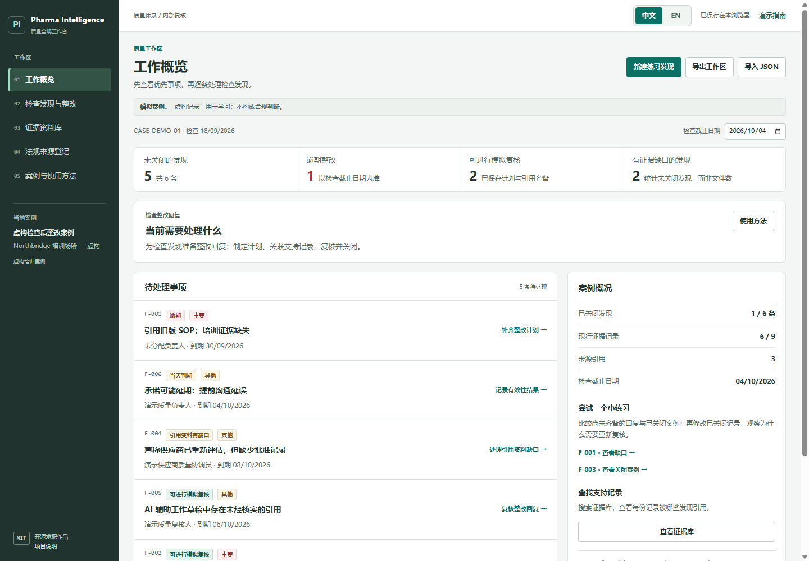
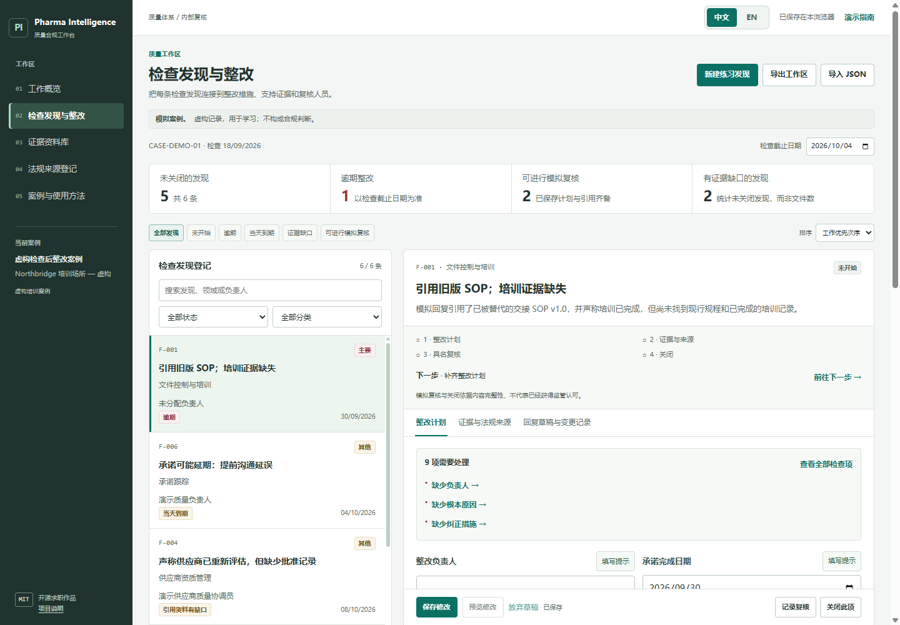

# Pharma Inspection Workbench：药品检查整改工作台

这是一个在浏览器里运行的学习工具，帮助你练习药企质量团队如何处理检查发现、安排整改和复核回复。

[English](README.md) · [案例说明](docs/case-study.md) · [官方来源](docs/source-notes.md) · [面试指南](docs/interview-guide.md) · [验证记录](docs/verification.md)



## 适合谁，解决什么练习问题？

适合了解药企 **QA（Quality Assurance，质量保证）** 的学生和求职者。QA 的工作包括检查流程和记录是否支持稳定的质量。这个项目是 **Pharma Intelligence Platform** 作品集中的一个小模块。

练习场景很具体：表格写着“整改完成”，但相关证据缺失或过期，或者回复还没有人复核。工具把这些缺口显示出来，帮助你跟踪下一步。

**CAPA** 是纠正与预防措施，即处理问题、减少重复发生。**MHRA** 是英国药品与医疗产品监管局。虚构案例参考了三份链接中的 MHRA 官方资料。

## 怎样打开？

在 GitHub 点击 **Code → Download ZIP**，解压后双击 `index.html`。不需要账户、安装程序或 API 密钥。

如果直接打开文件时浏览器保存不稳定，可以在项目文件夹运行以下命令，需要已安装 Python：

```sh
python -m http.server 4173 --bind 127.0.0.1
```

打开 [http://127.0.0.1:4173](http://127.0.0.1:4173)。结束时在终端按 `Ctrl+C`。

## 按五步练习

1. **读懂发现。** 明确问题是什么，还有哪些内容需要调查。
2. **安排任务。** 记录负责人、期限、根本原因、影响、行动和效果检查计划。
3. **连接依据。** 选择模拟证据与官方来源，检查记录是否缺失或过期。
4. **保存并复核。** 处理流程缺口，输入复核人名字，记录一次模拟审批。
5. **跟踪效果。** 记录效果结果后再关闭，最后导出内部报告或备份。

先从工作概览打开 **F-001**，尝试关闭并查看阻止原因。它缺少培训记录，不能用无关文件代替。

再打开资料完整、已经关闭的 **F-003**，对相关行动说明做一个小修改并保存。旧审批会失效，记录重新打开。检查修改后，重新记录模拟审批，再关闭一次。

## 0.6 版有哪些功能？

- **更顺畅的语言切换**：直接点击“中文 / EN”，保留编辑区、光标、草稿、筛选与滚动位置；同一份已保存案例的显示检查复用计算结果。中英文采用本地字体，字号更易读，页面与弹窗有简短过渡，并尊重系统“减少动态效果”设置。

- **修改前后对比**：保存前预览变动字段，保存后从变更记录查看修改前后的值。自动重新打开的状态也会显示；旧记录没有差异时会明确注明。

- **工作概览**：排列待处理事项，每条发现都有可点击的下一步。
- **可点击的统计**：查看未关闭、逾期、可模拟复核，以及有证据缺口的发现。
- **查找与排序**：快捷筛选，按工作次序、到期日期或编号排序；搜索支持演示案例的中英文内容。
- **逐字段填写提示**：九张问题卡帮助区分证据、未知事项、计划与已完成结果；不会替你填写案例结论。
- **草稿恢复**：浏览器存储可用时，未提交修改拥有独立的本地恢复副本。刷新后选择恢复或放弃，不会自动应用到记录。
- **更紧凑的编辑区**：缺口链接直接定位字段；跨页签保留草稿；桌面保存栏随编辑区滚动。`Ctrl/Cmd+S` 保存；在登记页和证据库中，光标位于输入框外时按 `/` 可进入搜索。
- **证据查找**：搜索、版本状态筛选，并查看每份记录被哪些发现引用。
- **新建练习发现**、浏览器本地保存、变更记录、JSON 备份与导入，以及标签为英文的 CSV/Markdown 内部报告。

工作概览依次排列：逾期、参考日期当天到期、引用资料缺口、可模拟复核、其他未关闭事项。这是透明的工作次序，不是监管风险评分。修改参考日期会改变日期提示，不会修改发现内容或审批。

“可进行模拟复核”表示已保存计划和引用通过完整性检查；关闭时另外需要已完成的有效性结果。“有证据缺口的发现”统计受影响的未关闭发现，不是文件数或缺失引用数。文件已关联，仍需要人工判断相关性。



[查看填写提示界面](docs/screenshots/guidance-zh.png) · [查看草稿恢复界面](docs/screenshots/draft-recovery-zh.png)

修改 F-003 后，点击**预览修改**，查看哪些字段会变化，以及保存是否会使复核失效。预览不会提交，可以继续编辑或直接保存。保存后进入**回复草稿与变更记录 → 查看已保存修改**。对比保留实际记录原文，不把界面译文写入历史。新的 JSON 备份保留差异，Markdown 报告也列出差异；CSV 只包含当前登记表。请用 0.5 或更新版本打开新备份。这些本地快照可以修改，不是经过身份认证的审计记录。

[查看修改预览](docs/screenshots/changes-zh.png) · [查看手机界面](docs/screenshots/changes-mobile-zh.png)

恢复副本**不是已保存发现**，不会更新统计、复核、历史或导出。请用“保存修改”提交编辑内容。恢复后仍需保存；放弃草稿不会改变已保存记录。修改已复核或已关闭发现时，只有保存实质性修改才会使原复核失效。

每个浏览器地址可恢复一条正在编辑的发现草稿。切换到其他发现时，仍会先询问是否放弃未提交修改。原记录已变更或恢复数据格式有误时，不会恢复旧草稿。草稿恢复依赖浏览器存储，不是受控备份、共享草稿或自动提交。存储失败时，请保留页签，保存到当前会话并导出 JSON。不同浏览器和地址使用不同存储；JSON 迁移已保存记录，不包含恢复副本。

首次使用默认中文，可切换英文，浏览器记住偏好。自定义内容按原文显示；与原始演示相同的文本可显示译文。实际存储记录保持原样。JSON 完整保留实际存储数据。切换语言不会修改数据或审批。

## 使用限制与求职展示

所有记录都标为**虚构数据**。不要输入真实患者、生产或雇主的机密资料。

程序检查字段和索引状态，不分析真实文档内容、不判断事实或证据相关性，也不能代替检查员或判定企业合规。没有文档上传、系统集成、身份验证、电子签名、防篡改审计记录或多人协作功能。导出的是内部报告，不是监管提交文件；证据在内部保留，按要求提供。

这是学习原型，不是经过验证的受监管系统。项目使用 AI 辅助开发，展示前应理解、审核并修改它。如实说明你的贡献，不把作品当作专业工作经历，也不宣称已经节省时间或保证通过检查。

## 检查与开源

已安装 Node.js 时，在项目文件夹运行：

```sh
node --test tests/*.test.cjs
```

实际检查结果与范围见[验证记录](docs/verification.md)。欢迎根据[贡献指南](CONTRIBUTING.md)改进。源码使用 [MIT 许可证](LICENSE)，链接中的官方资料保留自己的许可条款。
